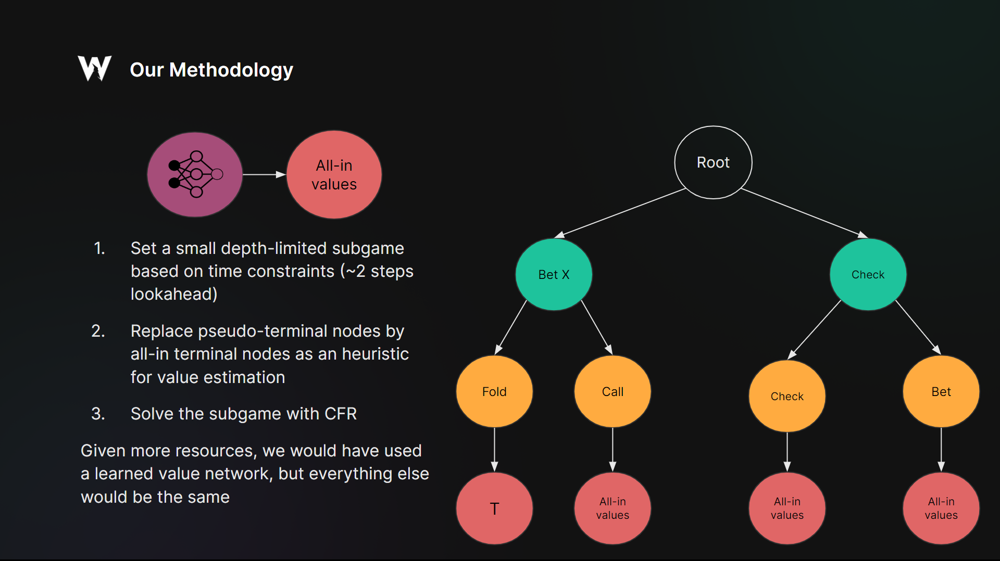

# MIT Pokerbots 2024
MIT organizes a computerized poker tournament every year @ https://pokerbots.org/, where the objective is for students to delve into applied topics of computer science, mathematics, statistics, and game theory, by competing against each other in a computerized poker tournament. Every year, the organizers come up with a creative poker variant to make the tournament unique.

This year's variant was Auction Hold'em:

### Auction Hold'em

Auction Hold'em is a fun twist on No-Limit Texas Hold'em, where a bidding round (auction) is added right after the flop cards have been dealt. In this bidding round, players bid for getting a third hole card. This is a second-price auction, so the winner of the bid only pays the second highest price. If both players bid the exact same price, then they both get a third card! Finally, the bid goes directly to the pot and the hand continues.


### GTO Wizard AI

As one of the main sponsor of the event, and the team behind [GTO Wizard AI](https://blog.gtowizard.com/introducing-gto-wizard-ai/), we thought it would be fun to submit our own entry into the tournament. As such, we spent around 5 days working on this implementation, which we are now open-sourcing :)

We've also given the final lecture of the class, where we gave an history of poker AI in the last 10 years, and talked about the state of AI in the poker industry. Slides can be found [here](assets/Lecture%207%20Slides.pdf).


## Methodology

First of all, the competition had some heavy constraints. Agents are given 30 seconds to play 1000 hands, which leaves only a few milliseconds to think per action! Also, an agent can't use more than 1GB of RAM and can't take more than 100MB of space when compressed.

Even with these constraints, we wanted to build a general AI that would scale arbitrarly given more compute and data, and also showcase some key aspects of our technology here at GTO Wizard AI.

The technological breakthroughs of AI in the last decade have shown the incredible expressive power of deep neural networks (DNNs). In poker, DNNs can be used as value networks, where their job is to predict the values of each hand in each player's range, assuming that players play optimally from that point forward. 

By replacing the exact values by the approximation of a DNN, we can create small depth-limited subgames and solve them much faster than solving the entire game:


However, due to the heavy constraints on thinking time and limited time for implementing the AI, using a learned value network was out of the scope of this project. As a cheap alternative, we replace this network by an heuristic, where we assume that both players get the values corresponding to their equities.



This is the same values that a player would get at an all-in node, so we call them `All-in values`. This is not considered to be a good heuristic and could never achieve superhuman performance, but given more time and more resources, the architecture would remain the same, except that this heuristic would be replaced by the values coming from a DNN, which shows the generality of this approach.


### Poker hand evaluator (`poker_hand.h`)

`csrc/scripts/generate_rank_bases.cpp` and `csrc/scripts/generate_evaluator_tables.cpp` are used to generate a poker hand evaluator that calculates information about hand strength, flush draw or not, and number of straight draw outs.
The logic is based on the [OMPEval] library, but supports 5 to 8 card hands (specialized for Auction Hold'em!).
It is extremely efficient, and it can evaluate 400 million random hands per second with a single thread (on M3 Max MacBook Pro).

[OMPEval]: https://github.com/zekyll/OMPEval

### Terminal values calculator (`equity.h`, `equity.cpp`)

The `compute_cfvs_showdown` function calculates counterfactual values for "terminal nodes".
Before calculating the counterfactual values, we need to evaluate all possible hands and sort them by strength, which takes O(n log n) time (n = 22,100 = (52 choose 3)).
Once sorted, `compute_cfvs_showdown` runs in O(n) time, performing 6,000 calculations per second for cases where both players have three hole cards (on the same MacBook Pro).
When either of the two players has folded, we use `compute_cfvs_fixed_payoff` instead to calculate counterfactual values more efficiently.

Here, "terminal nodes" may not refer to the actual end of the game.
On the flop and turn, "terminal values" are calculated as if the game ends on the current street, i.e., there are
no more betting rounds.
This abstraction makes draw hands undervalued, so we added a special treatment to "boost" the values of flush draws and straight draws.
However, this treatment is only a heuristic and does not necessarily give well-defined values, and also it turns out that it does not seem to improve performance significantly.

### The Auction

Before getting into our approach for the auction we should define the difference between expected value and equity:

- Equity: The percentage of the time our hand (or range of hands) will win the pot against our opponent's range. 

- Expected Value (EV): The amount of money a hand (or range) is expected to win. Consider a hand with 100% equity. If we make a pot sized bet with that hand and get called 50% of the time - then the expected value of our hand is 1.5 times the pot (1 from the pot, .5 from when we get called and win). 

We say that a range of hands "overrealizes" its equity if its EV is greater than its equity multiplied by the size of the pot. We say that a hand "underrealizes" its equity if its EV is less than its equity multiplied by the size of the pot.

The optimal approach given the time constraint of 1000 hands in 30 seconds would have almost certainly been to make a blueprint of the game based on an abstraction of the game that is much smaller than the game itself and solving it via MCCFR. 

However, we wanted our approach to scale well without the time constraint - and an abstraction based method does not. This presents a particular problem for the auction because it is early enough in the game tree that the expected value of bidding can't be computed quickly enough (even if we make assumptions about the behavior of both players' pre-flop strategy and only solve the post-flop subgame).

Equity, on the other hand, is an easy proxy for expected value that can be easily computed without solving an entire subgame. We computed "3v2 - 2v3" - i.e. the equity that each hand would have given if it gets the extra card subtracted by the equity that hand would have if the opponent gets the extra card. We did this for every hand on every distinct board against a uniform random range of hands - resulting in a matrix of 1755 x 1326 precomputed equity difference values. 

Just considering equity is not enough. We also need to consider that the player with the third card will often overrealize (this is because they can leverage having better hands on average to force their opponent to fold out his equity - forcing the opponent to underrealize. The idea that a player that has a large density of superior hands can force their opponent to underrealize is a well known principle in poker that is confirmed by solvers of traditional NLHE). This incentivises us to bid higher than our equity alone would dictate.

We elected to represent this overrealization by multiplying our preferred bid by a constant multiple in all spots (this could be made to be more granular - for example the in position player is likely going to overrealize more than the out of position player). In order to represent overrealization - we ran monte carlo simulations to compare the outcomes of different bid multipliers. Bots that won the card for 1.8 times the equity based bid outperformed all bots that won the auction for values between 0.5-2.5. 

So in short our bidding approach was to choose a bid based on the equity of our hand against a random range - then scale that bid to account for the fact that the player with 3 cards will likely overrealize their equity. 


### Time Manager

To optimize the game solving within the 30-second solving time constraint for 1000 hands, we've implemented a `TimeManager` class (`time_manager.h`) for efficient time allocation. This class takes charge of managing the time distribution across the four rounds of each hand: Preflop, Flop, Turn, and River. Our goal is to allocate more time to rounds that inherently are time consuming, ensuring enough time allocated to the solving algorithms.

At the onset of the game, an instance of the `TimeManager` class is instantiated in the `MainBot` class (`main_bot.cpp`). During the execution of the `get_action_any_player` function, this instance is invoked, with some actions exempt from time scheduling, such as those involving precomputed data or scenarios where only one legal action is viable. For actions that involve time-consuming solving processes, the `TimeManager` class is utilized by invoking the `get_time_budget_ms` function, which returns the time limit in milliseconds.

Notably, the `TimeManager` class calculates the time budget based on the expected number of remaining actions, and the remaining time until the conclusion of the game. This allocation is based on predefined ratios for each game round.


## Running the code

### Dependencies
 - python>=3.12
 - cython (pip install cython)
 - eval7 (pip install eval7)
 - C++17 
 - boost (`sudo apt install libboost-all-dev`)

### Pre-Commit Hooks

We format our code with `clang-format` for the C++ code. To avoid having to commit code multiple times
to pass linting tests, we use pre-commit hooks. To set these up, you should have `pre-commit` installed (this should already be in the python development dependencies), and then you can run

```bash
pre-commit install
```

### Arena Benchmarks

Find our [benchmarks here](https://github.com/ruse-ai/mitpokerbots-2024/tree/gh-pages)
